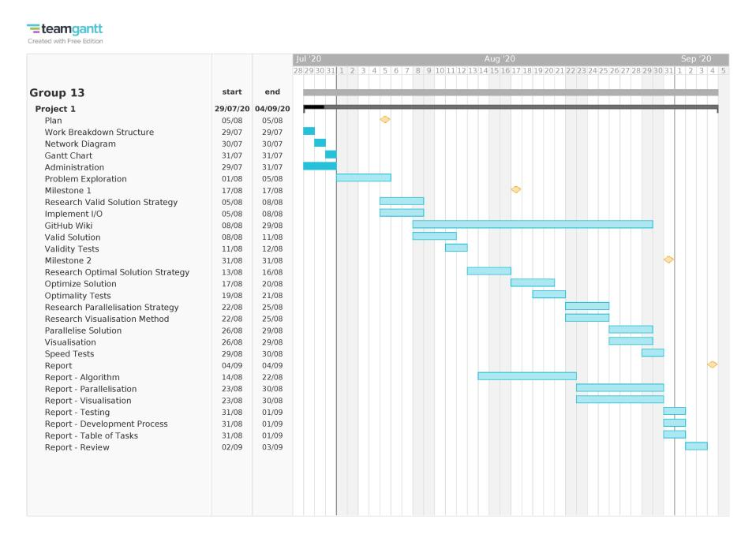

# Project Workflow
This page documents the organisation and distribution of the project.
## Project Timeline
The Gantt chart below shows the expected timeline for the completion of
tasks needed for the project:
 
 
## Meetings
Team meetings were conducted in person on a regular basis (3 times a week). 
These moved to online meetings via Discord during level-3 lockdown.
Meetings were organised by the team leader, Peter.
Outcomes of the meetings were documented on Google Drive.

## Collaboration Tools
GitHub was used for version control.
Both Discord and Google Drive were used for file sharing.
Discord was the primary means of communication.
The issue tracker on GitHub was used for delegation and record keeping of tasks.

## Workflow Distribution
### Milestone 1
[Milestone 1](Milestone1.md) was separated into three main sections which could be
worked on in parallel. These were distributed as follows:
- I/O parsing (Peter and Sheldon)
- Valid schedule implementation (Tushar and Yuno)
- Validity testing (Elisa)

Planning of skeletal code, defining interfaces between sections, writing documentation, 
and selecting the valid solution strategy was done as a team.

### Milestone 2
This milestone has not yet been reached.
