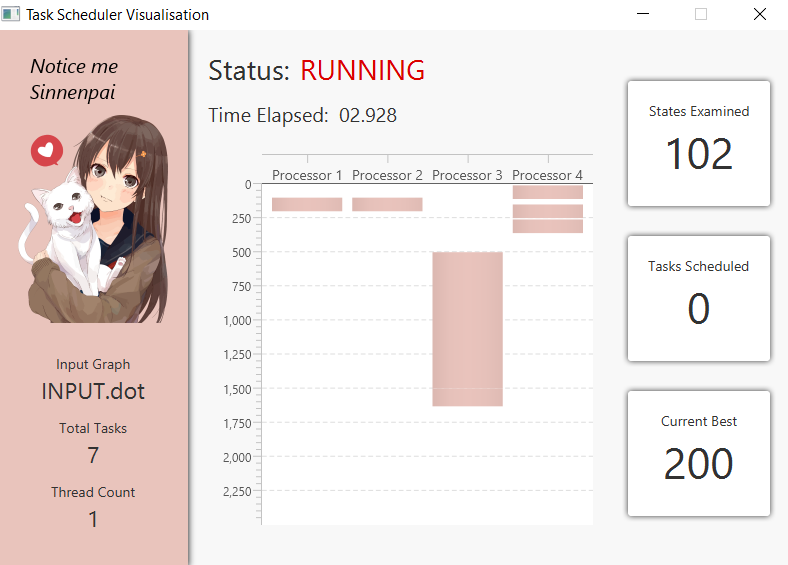

# Visualisation
As part of milestone 2, a visualisation of the scheduling algorithm was added.
This can be enabled by including the `-v` flag when running the program.
## Goals
The goals of the visualisation were to provide a meaningful reflection of the algorithm,
 as it exhaustively searches the possible schedules. 
 We wanted to include both a visual representation of the partial schedules created,
 as well as some informative statistics about the execution of the algorithm.
## Solution
The interface for the visualisation is shown below:

The main chart displays the partial schedule which is being searched by the algorithm.
This is updated live as the algorithm executes, along with the time elapsed, states searched, tasks scheduled, and best finishing
time found so far.
## Implementation
[JavaFX](https://openjfx.io/) was used, along with [Scene Builder](https://gluonhq.com/products/scene-builder/)
in order to easily integrate with the rest of the project and speed up development.
To convert the project into a java application, we made the `Driver` class extend `javafx.application.Application`.
If the `-v` flag is received, we launch the application.
The `Controller` class encapsulates the logic of the GUI, while the visual components are described in `visualisation-view.fxml`.
### Multi-threading
The application runs on the main GUI thread, which is automatically managed by javaFX to poll for events.
The solution thus needs to run on background threads, and update the polling GUI thread.
We achieved this by refactoring the algorithm processing into subclasses of `javafx.concurrent.Task`.
This is explained in more detail [here](./Parallelisation.md).
## Issues
The algorithm runs very quickly with a few nodes (<14) and/or processors, so the live updates to the GUI can be hard to see.
